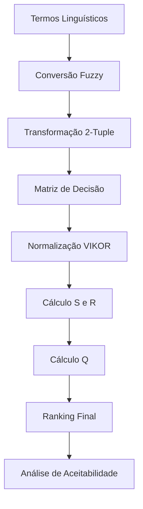
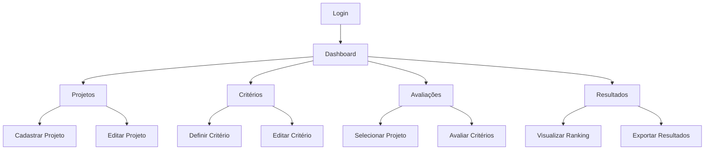

## 1. Product Overview

Sistema web completo para apoio à tomada de decisão em portfólio de projetos de software, utilizando lógica fuzzy, modelo linguístico 2-tuple e método VIKOR para ranqueamento e priorização de projetos.

O sistema permite cadastrar projetos, definir critérios com pesos, inserir avaliações linguísticas e gerar rankings automáticos com visualizações gráficas para auxiliar gestores na seleção e priorização de projetos de software.

## 2. Core Features

### 2.1 User Roles

| Role            | Registration Method     | Core Permissions                                       |
| --------------- | ----------------------- | ------------------------------------------------------ |
| Administrator   | System initialization   | Full access to all features, user management           |
| Project Manager | Email registration      | Create/edit projects, define criteria, run evaluations |
| Analyst         | Invitation/registration | Input linguistic evaluations, view results             |

### 2.2 Feature Module

O sistema de apoio à decisão em portfólio de projetos consiste nos seguintes módulos principais:

1. **Dashboard**: visão geral do portfólio, estatísticas e acesso rápido
2. **Projetos**: cadastro, edição e gerenciamento de projetos de software
3. **Critérios**: definição de critérios de avaliação com pesos
4. **Avaliações**: inserção de avaliações linguísticas por projeto/critério
5. **Resultados**: visualização do ranking VIKOR com gráficos e análises

### 2.3 Page Details

| Page Name  | Module Name            | Feature description                                                                      |
| ---------- | ---------------------- | ---------------------------------------------------------------------------------------- |
| Login      | Authentication         | Realizar login com email e senha, recuperação de senha                                   |
| Dashboard  | Overview               | Exibir cards com total de projetos, critérios, avaliações pendentes e últimos resultados |
| Dashboard  | Quick Actions          | Acesso rápido para adicionar projeto, definir critério, realizar avaliação               |
| Projetos   | Project List           | Listar todos os projetos com busca, filtros e paginação                                  |
| Projetos   | Add Project            | Modal para cadastrar novo projeto com nome, descrição e data                             |
| Projetos   | Edit Project           | Modal para editar informações do projeto                                                 |
| Projetos   | Delete Project         | Confirmar exclusão com validação de dependências                                         |
| Critérios  | Criteria List          | Listar critérios com pesos, tipo (benefício/custo) e ações                               |
| Critérios  | Add Criteria           | Modal para definir nome, descrição, peso e tipo do critério                              |
| Critérios  | Edit Criteria          | Modificar informações e pesos dos critérios                                              |
| Critérios  | Weight Validation      | Garantir que soma dos pesos equals 100%                                                  |
| Avaliações | Project Selection      | Selecionar projeto para avaliação                                                        |
| Avaliações | Criteria Evaluation    | Inserir termos linguísticos (baixo, médio, alto, etc.) para cada critério                |
| Avaliações | Fuzzy Conversion       | Converter termos linguísticos para valores fuzzy automaticamente                         |
| Avaliações | 2-Tuple Processing     | Transformar valores fuzzy para representação 2-tuple                                     |
| Resultados | VIKOR Ranking          | Calcular e exibir ranking final com S, R e Q valores                                     |
| Resultados | Radar Chart            | Visualização gráfica de desempenho por critério                                          |
| Resultados | Bar Chart              | Comparação visual entre projetos ranqueados                                              |
| Resultados | Acceptability Analysis | Verificar condições de aceitabilidade do VIKOR                                           |
| Resultados | Export Results         | Exportar resultados em PDF/Excel                                                         |

## 3. Core Process

### Fluxo Principal do Usuário

1. **Login**: Usuário autentica-se no sistema
2. **Dashboard**: Visualiza visão geral do portfólio
3. **Cadastro de Projetos**: Adiciona projetos de software com informações básicas
4. **Definição de Critérios**: Estabelece critérios de avaliação com pesos apropriados
5. **Avaliação Linguística**: Para cada projeto, avalia cada critério usando termos linguísticos
6. **Processamento Fuzzy-2-Tuple**: Sistema converte automaticamente termos para valores fuzzy e depois para 2-tuple
7. **Cálculo VIKOR**: Sistema executa algoritmo VIKOR completo
8. **Visualização de Resultados**: Usuário analisa ranking, gráficos e justificativas
9. **Tomada de Decisão**: Com base nos resultados, gestor toma decisões de portfólio

### Fluxo do Algoritmo

### Navegação entre Páginas

## 4. User Interface Design

### 4.1 Design Style

* **Cores Primárias**: Azul moderno (#3B82F6) - usado para elementos principais, botões primários, links

* **Cores Secundárias**: Cinza grafite (#1F2937) - textos, headers, elementos secundários

* **Background**: Cinza claro (#F3F4F6) - fundo geral da aplicação

* **Botões**: Estilo arredondado com sombra sutil, hover effects suaves

* **Tipografia**: Fonte sans-serif moderna (Inter ou similar), tamanhos: 14px para texto, 16px para labels, 20px para headers

* **Layout**: Card-based com sidebar fixa, top navigation breadcrumb, grid responsivo

* **Ícones**: Feather Icons ou Lucide React, estilo outline consistente

### 4.2 Page Design Overview

| Page Name  | Module Name         | UI Elements                                                                                                  |
| ---------- | ------------------- | ------------------------------------------------------------------------------------------------------------ |
| Login      | Form                | Card centralizado com logo, campos de email/senha, botão primário azul, link para recuperação                |
| Dashboard  | Overview            | Grid de cards coloridos com métricas, gráfico de pizza para status de projetos, lista de atividades recentes |
| Dashboard  | Quick Actions       | Botões com ícones para ações rápidas, layout horizontal no topo                                              |
| Projetos   | Project List        | Tabela DataTable com colunas: nome, descrição, data, ações (editar/deletar), barra de busca superior         |
| Projetos   | Add Project         | Modal com campos de formulário, botões de ação na parte inferior, validação em tempo real                    |
| Critérios  | Criteria List       | Tabela com nome, descrição, peso (slider visual), tipo (badge colorido), ações                               |
| Critérios  | Add Criteria        | Modal com formulário, slider para peso, radio buttons para tipo, validação de soma de pesos                  |
| Avaliações | Project Selection   | Dropdown de seleção, card com informações do projeto selecionado                                             |
| Avaliações | Criteria Evaluation | Lista de cards para cada critério, dropdown com termos linguísticos, preview do valor fuzzy                  |
| Resultados | VIKOR Ranking       | Tabela ordenada com posição, projeto, valores S/R/Q, badges de aceitabilidade                                |
| Resultados | Radar Chart         | Chart.js radar chart mostrando desempenho por critério, cores diferenciadas por projeto                      |
| Resultados | Bar Chart           | Gráfico de barras horizontal comparando valores Q, escala de 0-1                                             |

### 4.3 Responsiveness

* **Desktop-first**: Layout otimizado para telas grandes (1920x1080), sidebar fixa visível

* **Mobile-adaptive**: Sidebar vira hamburger menu, tabelas viram cards empilhados, modals adaptam-se à tela

* **Touch optimization**: Botões com área de toque mínima 44x44px, suporte a swipe em tabelas, touch-friendly dropdowns

* **Breakpoints**: 640px (mobile), 768px (tablet), 1024px (desktop), 1280px (large desktop)

